# Recurrent Looped Transformer

[](./Recurrent_Looped_Transformer.pdf)
[](https://yifanzhang-pro.github.io/recurrent-looped-tranformer/)

### Recurrent computation across prompt and response

**Recurrent Looped Transformer (RLT)** feeds the previous token's final decoder state into the current token's decoder input through a gated merge, so the computation path grows with sequence length at a fixed per-token cost.
A parallel causal encoder supplies token representations and global key–value (KV) memory, and the decoder keeps a sliding-window attention (SWA) cache at every layer.
The same update runs over prompt and response tokens.

**Authors:** [Yifan Zhang](https://yifzhang.com)¹, Jichen Feng², Shihan Qin² · ¹Princeton University, ²University of Pennsylvania

**Report:** September 12, 2026 · **Updated:** October 5, 2026

[[Paper](./Recurrent_Looped_Transformer.pdf)] [[中文论文](./Recurrent_Looped_Transformer_ZH.pdf)] [[Project website](https://yifanzhang-pro.github.io/recurrent-looped-tranformer/)] [[Depth allocation](#depth-allocation-and-length-generalization)] [[Feedback frequency](#feedback-frequency)] [[Complete six-task study](#complete-six-task-study-at-2000-steps)]

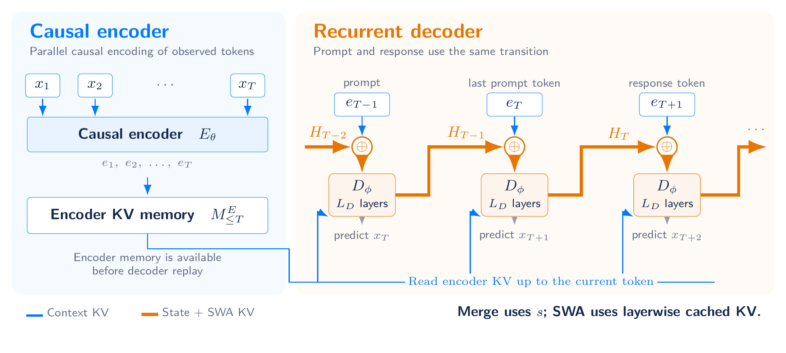

## Architecture

For token $x_t$, let $e_t$ be its causal encoder representation and $M_{\le t}$ the encoder-derived global KV memory.
The decoder state includes both the recurrent output and layerwise SWA KV:

```math
H_t=(s_t,C_t^D),\qquad H_0=(s_\star,\varnothing).
```

```math
(s_t,C_t^D)=D_\phi\!\left(\mathrm{Merge}(e_t,s_{t-1});M_{\le t},C_{t-1}^D,t\right).
```

- **Global context:** encoder outputs are projected into cached KV; cross-attention reads positions up to the current token. With one memory group ($G=1$), all decoder layers read the same projected KV using their own queries.
- **Local memory:** each decoder layer projects its own SWA KV. A window of $W$ includes the current token and retains up to $W-1$ past entries for the next update.
- **Hidden-state feedback:** the previous final decoder output enters the next token's gated merge. The state continues across the prompt–response boundary.

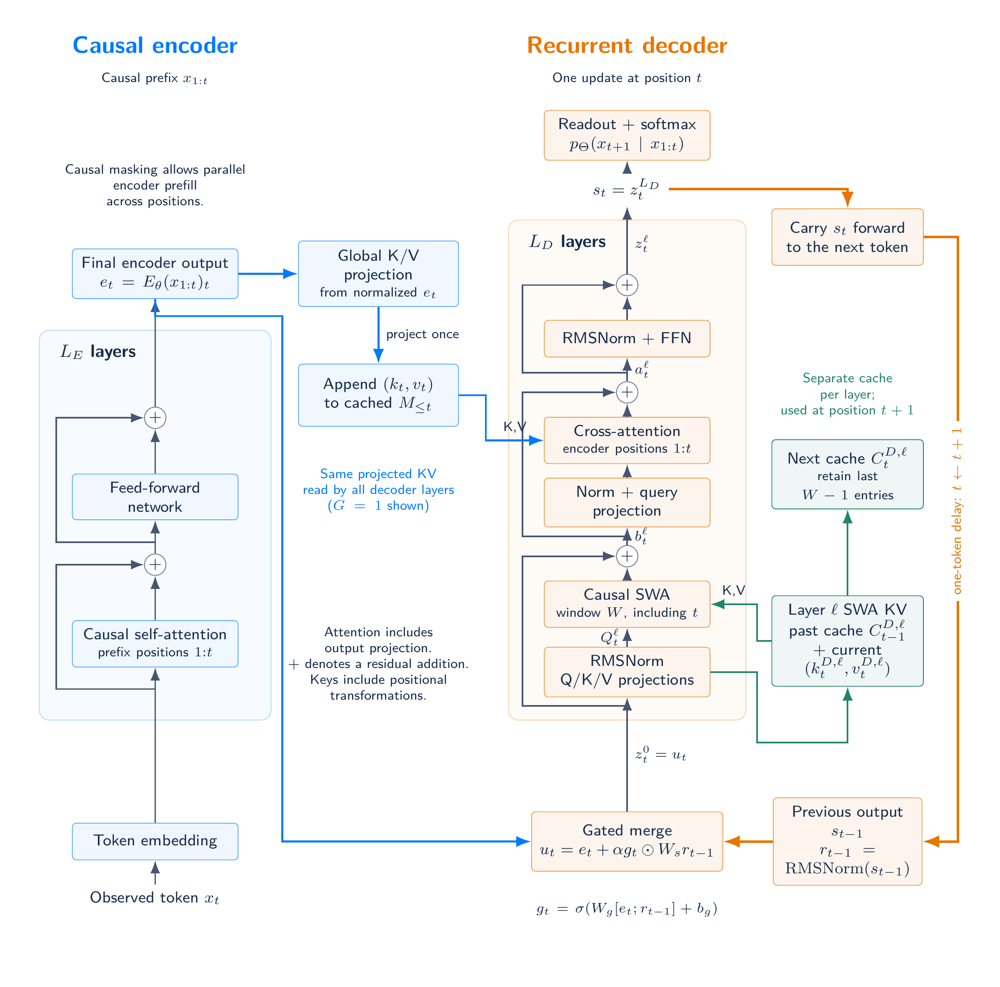

[Architecture PDF](assets/architecture-detail.pdf)

After $t$ tokens, the recurrent path traverses $tL_D$ decoder blocks while the number of blocks evaluated per token stays fixed.
Compatible encoder and decoder attention and FFN weights can be shared; a tied 48+48 layout illustrates this option in the report.
The experiments below use untied eight- and sixteen-layer layouts.

### Feedback interval: RLT-1, RLT-2 and RLT-0

RLT-1 and its two controls differ in one quantity, the feedback interval $B$: the number of tokens between updates of the state that enters the decoder input.
RLT-1 updates this state at every token ($B=1$), RLT-2 once per chunk of $B$ tokens, and RLT-0 never ($B=\infty$).
All three keep the causal encoder, encoder memory, decoder SWA, prefix-restricted memory attention and readout of RLT-1.

**RLT-2** holds the feedback state fixed within a chunk and replaces it with the chunk's last decoder output at a complete boundary.
Each position merges its encoder output with this boundary state through its own gate, and known positions run together within each decoder layer under causal SWA and prefix-restricted encoder memory.
Boundaries are anchored at BOS, and a partial chunk keeps the previous boundary state, so moving the prompt–response split does not change the computation.
With $B=1$, RLT-2 reduces exactly to RLT-1.


[Chunk architecture PDF](assets/rlt2/architecture-chunk.pdf)

**RLT-0** is the $B=\infty$ limit.
It removes the feedback path together with the learned initial state, state normalization, gate and feedback projection, and feeds $z_t^0=e_t$ to the decoder.
At each eight-layer split, it has 787,968 fewer parameters than RLT-1.
[RLT-0 architecture](assets/architecture-no-feedback.png) · [PDF](assets/architecture-no-feedback.pdf)

For a known prefix of length $T$, the decoder needs $\lceil T/B\rceil L_D$ sequential block stages: $TL_D$ for RLT-1 and $L_D$ for RLT-0.
All three evaluate $TL_D$ decoder blocks and generate one token per step.

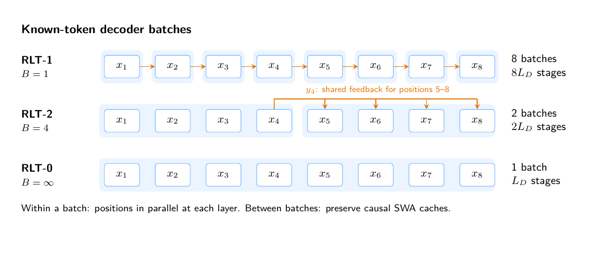

Because RLT-2 uses the same parameters for every $B$, the chunk size can also vary during training: pretraining can start with large chunks for parallelism, and mid- and post-training can reduce $B$ toward 1.
The experiments train each chunk size from scratch.

## Results

The experiments ask how to allocate eight layers between the encoder and decoder, and how often to feed back the final decoder state.
The six algorithmic tasks are addition, parity, modular arithmetic (mod 5) with and without brackets, and standard and swaps-based S5 permutation tracking.
Every eight-layer comparison uses initialization seeds 42, 43 and 44 with shared training data and test sets, and reports mean ± sample standard deviation (SD, n = 3).

Models have width 512, FFN width 1,365 and four attention heads.
RLT-1 uses an SWA window of eight, one encoder-memory group, feedback scale 0.1 and TBPTT 128, which covers every training sequence.
In these comparisons, parity, addition and S5 train for 2,000 steps and mod 5 for 5,000.
RLT-1 has 26.10–28.73M parameters and Transformer 8 has 25.31M, so equal layer counts do not match parameters or compute.
Length generalization uses each run's checkpoint with the lowest in-distribution validation loss, taking the earliest step on ties, and evaluates 1,024 shared examples per length (256 operand pairs for addition).

### Depth allocation and length generalization

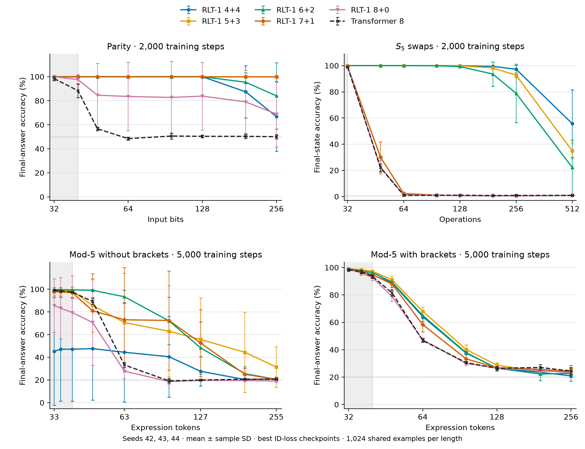

Gray regions mark training lengths, dotted lines mark uniform-prediction accuracy, and error bars show untrimmed sample SD.
Parity and swaps-S5 use 2,000-step runs; both mod-5 tasks use 5,000-step runs for every model.
[PDF](assets/main-results/depth-allocation-generalization.pdf) · [SVG](assets/main-results/depth-allocation-generalization.svg)

- **Parity:** after training on at most 40 bits, 5+3 and 7+1 reach **100 ± 0%** at 256 bits in all three seeds; Transformer 8 reaches 50.07 ± 1.63%. At step 500, 6+2 already reaches 99.44 ± 0.98% validation accuracy, versus 48.48 ± 0.53% for the Transformer.
- **Swaps-S5** favors a larger decoder. At 256 operations, eight times the training length, 4+4 reaches **97.30 ± 2.76%** final-state accuracy, versus 0.85 ± 0.30% for the Transformer; at 512 operations it still reaches 55.70 ± 25.78%. Splits 7+1 and 8+0 are near the uniform reference at 256 operations despite high training-length accuracy.
- **Mod 5:** on flat expressions of length 63, 6+2 reaches **93.36 ± 5.69%**, versus 33.20 ± 2.33% for the Transformer. On bracketed expressions of length 64, 5+3 reaches 67.97 ± 2.91%, versus 46.71 ± 1.21%. Accuracy falls on longer expressions, and several flat mod-5 splits vary widely across seeds.

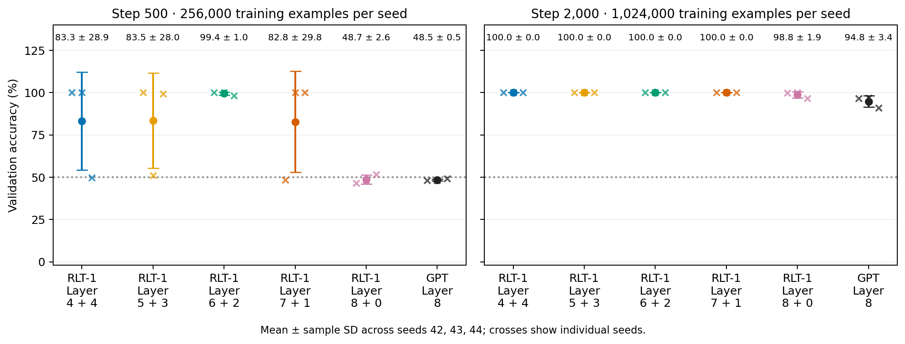

Both panels use the same 768 validation examples, after 256,000 and 1,024,000 training examples per seed.
[PDF](assets/experiments-depth8/parity-errorbars.pdf)

### Feedback frequency

RLT-0 and RLT-2 with four-token chunks (chunk4) were trained at every split with the data, optimizer and seeds of the RLT-1 runs.
RLT-2 has the same parameters as RLT-1.

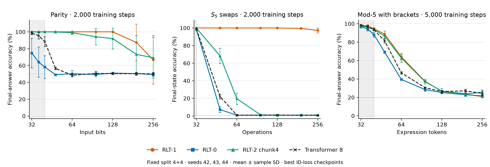

[PDF](assets/main-results/feedback-frequency-generalization.pdf) · [SVG](assets/main-results/feedback-frequency-generalization.svg)

At 64 bits, RLT-1 reaches 100 ± 0% parity accuracy and chunk4 98.99 ± 1.66%, while RLT-0 stays near chance at 50.23 ± 3.80%.
Swaps-S5 is more sensitive to the interval: at 64 operations, RLT-1 reaches 100 ± 0% and chunk4 19.60 ± 6.54%, and RLT-0 and the Transformer are near the 1/120 uniform reference.
Relative to RLT-1, four-token chunks lose about one percentage point on 64-bit parity and about 80 points on 64-operation swaps-S5.

The effect of chunking also depends on the split.
Chunk4 4+4 retains 69.34 ± 24.17% parity accuracy at 256 bits, whereas chunk4 7+1 and 8+0 are near chance at 64 bits.
On swaps-S5, chunk4 5+3 reaches 79.92 ± 10.89% at 48 operations and 50.16 ± 18.77% at 64.

Best-checkpoint test accuracy (%) at 4+4, mean ± sample SD over three seeds:

| Task / length | RLT-1 | RLT-0 | RLT-2 chunk4 | Transformer 8 |
| --- | ---: | ---: | ---: | ---: |
| Parity / 64 | 100.00 ± 0.00 | 50.23 ± 3.80 | 98.99 ± 1.66 | 48.47 ± 1.18 |
| S5 swaps / 48 | 100.00 ± 0.00 | 7.26 ± 3.17 | 68.29 ± 8.75 | 22.10 ± 2.76 |
| S5 standard / 32 | 1.53 ± 0.46 | 1.20 ± 0.72 | 1.37 ± 0.87 | 0.91 ± 0.15 |
| Mod 5, flat / 63 | 44.43 ± 43.81 | 21.84 ± 2.17 | 50.78 ± 38.02 | 33.20 ± 2.33 |
| Mod 5, brackets / 64 | 64.10 ± 3.49 | 39.45 ± 0.61 | 62.76 ± 4.42 | 46.71 ± 1.21 |

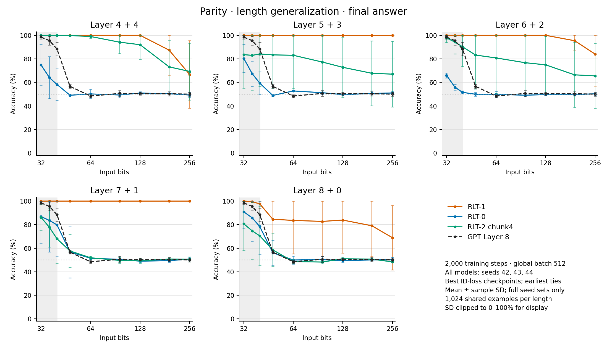

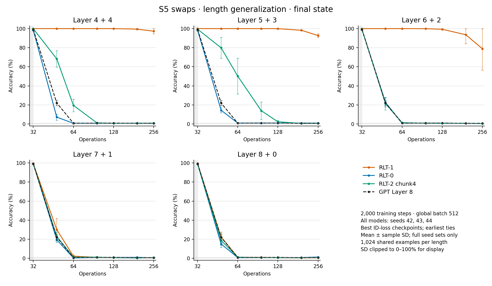

[Standard S5](assets/variants-20260925/s5-standard-generalization.png) · [Flat mod 5](assets/variants-20260925/mod5-no-brackets-generalization.png) · [Bracketed mod 5](assets/variants-20260925/mod5-with-brackets-generalization.png) · [Validation at 4+4](assets/variants-20260925/variants-validation-overview.png) · [All variant figures](assets/variants-20260925/README.md)

#### CPU training-step time

Seed-42 mean seconds per step at 4+4, over steps 1,001–2,000 with four CPU threads and FP32 on a shared cluster.
The averages exclude validation, checkpoint writes and logging.

| Model (4+4) | Flat mod 5 | Bracketed mod 5 |
| --- | ---: | ---: |
| RLT-1 | 62.59 | 54.09 |
| RLT-2 chunk4 | 27.52 | 23.81 |
| RLT-0 | 14.54 | 12.98 |

Chunk4 training steps run **2.27×** as fast as RLT-1 steps, and RLT-0 steps **4.17–4.30×** as fast.
These are CPU training steps; wall-clock speed on other hardware depends on the implementation.

### Addition, standard S5 and scope

All models reach 100% teacher-forced accuracy on 1–8-digit addition validation, but accuracy drops beyond eight digits; at 32 digits the eight-layer model means range from 14.89% to 16.84%.
Standard S5 remains near the 1/120 reference across feedback variants.
A three-seed ablation of the feedback scale finds no consistent effect on addition: across 63 comparisons with α = 0.1 at the same split and width, lowering α to 0.03 or 0.01 raises 37 means and lowers 26, and only three differences exceed both sample SDs ([figure](assets/addition-feedback-20261005/generalization-three-seed.png)).
These experiments use supervised training; RL performance is not evaluated.

### Complete six-task study at 2,000 steps

The September 17, 2026 snapshot compares **RLT-1 4+4, 5+3, 6+2, 7+1, 8+0 and Transformer 8** on all six tasks.
All **108 runs** completed **2,000 optimizer steps** with initialization seeds **42, 43 and 44 for every task**.
The 8+0 variant has no decoder blocks but still applies the gated recurrent merge.

#### Validation accuracy after 2,000 steps

Values are percentages, reported as mean ± sample SD across three initializations.
Each run has consumed 1,024,000 training examples.
Addition measures **teacher-forced answer-token accuracy**, including answer formatting and EOS, excluding prompt and padding positions.
Parity and mod 5 score the final label; S5 scores the final state.

| Task | RLT-1 4+4 | RLT-1 5+3 | RLT-1 6+2 | RLT-1 7+1 | RLT-1 8+0 | Transformer 8 |
| --- | ---: | ---: | ---: | ---: | ---: | ---: |
| Addition | 100.00±0.00 | 100.00±0.00 | 100.00±0.00 | 100.00±0.00 | 100.00±0.00 | 100.00±0.00 |
| Parity | 100.00±0.00 | 100.00±0.00 | 100.00±0.00 | 100.00±0.00 | 98.83±1.92 | 94.84±3.43 |
| Mod 5, no brackets | 45.36±46.43 | 94.18±7.29 | 69.62±33.01 | 70.01±43.15 | 60.33±35.70 | 64.02±37.64 |
| Mod 5, brackets | 70.53±10.75 | 74.35±6.71 | 74.87±3.72 | 74.78±3.01 | 75.17±6.78 | 73.87±9.07 |
| S5, swaps | 100.00±0.00 | 100.00±0.00 | 100.00±0.00 | 99.35±0.81 | 99.61±0.68 | 99.09±0.23 |
| S5, standard | 0.78±0.68 | 2.47±1.26 | 2.21±1.48 | 2.08±0.98 | 1.82±1.19 | 0.52±0.23 |

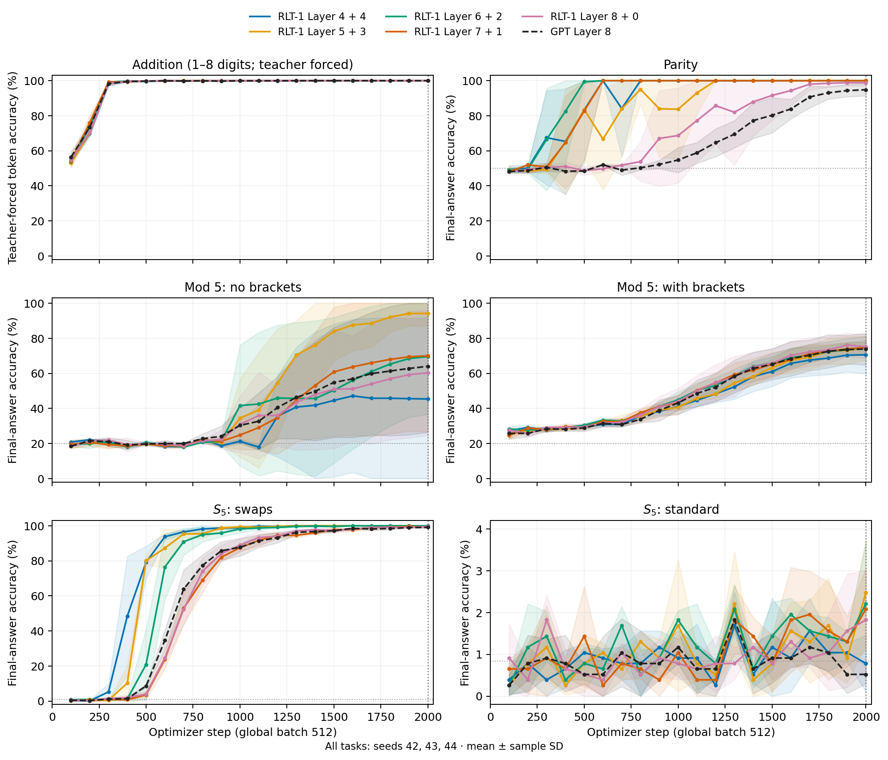

Bands show sample SD, clipped to the accuracy range. Standard S5 uses a narrower vertical scale.
[PDF](assets/experiments-depth8/validation-curves.pdf)

At 2,000 steps, flat mod 5 varies strongly with initialization: the three 4+4 seeds score 17.58%, 19.53% and 98.96%.
Bracketed mod-5 means are closer, spanning 70.53–75.17% for RLT-1 versus 73.87 ± 9.07% for the Transformer.
The 5,000-step runs in the results above train both mod-5 tasks longer.

#### Length generalization

The evaluation covers **846 model–seed–length combinations**, summarized as 282 three-seed means and sample SDs.
At every task and length, all models and seeds receive the same 256 addition pairs or 1,024 formal-task sequences.

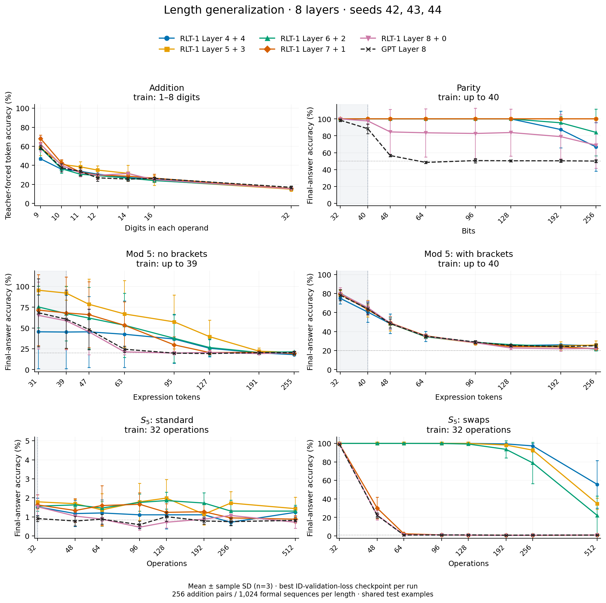

Gray regions mark training lengths. Addition uses teacher-forced answer tokens; other tasks use final labels or states.
[PDF](assets/experiments-depth8/generalization-depth08-primary.pdf)

Accuracy at the longest tested length, in percent.
Addition lengths count digits per operand; formal-task lengths count input symbols or operations, excluding boundary markers.

| Task (test length) | RLT-1 4+4 | RLT-1 5+3 | RLT-1 6+2 | RLT-1 7+1 | RLT-1 8+0 | Transformer 8 |
| --- | ---: | ---: | ---: | ---: | ---: | ---: |
| Addition (32) | 15.30±0.44 | 14.89±2.27 | 15.74±1.58 | 15.59±1.57 | 15.31±0.93 | 16.84±1.45 |
| Parity (256) | 66.76±28.78 | 100.00±0.00 | 84.05±27.63 | 100.00±0.00 | 68.91±27.39 | 50.07±1.63 |
| Mod 5, no brackets (255) | 18.00±0.39 | 20.57±0.62 | 21.42±0.49 | 19.34±0.54 | 20.44±0.91 | 20.35±2.01 |
| Mod 5, brackets (256) | 25.20±1.71 | 25.81±4.34 | 21.58±1.86 | 22.04±1.72 | 22.30±1.13 | 25.07±2.05 |
| S5, standard (512) | 1.24±0.30 | 1.43±0.60 | 1.30±0.31 | 0.88±0.20 | 0.72±0.31 | 0.81±0.06 |
| S5, swaps (512) | 55.70±25.78 | 34.86±6.10 | 22.14±20.95 | 0.85±0.06 | 0.85±0.20 | 0.85±0.30 |

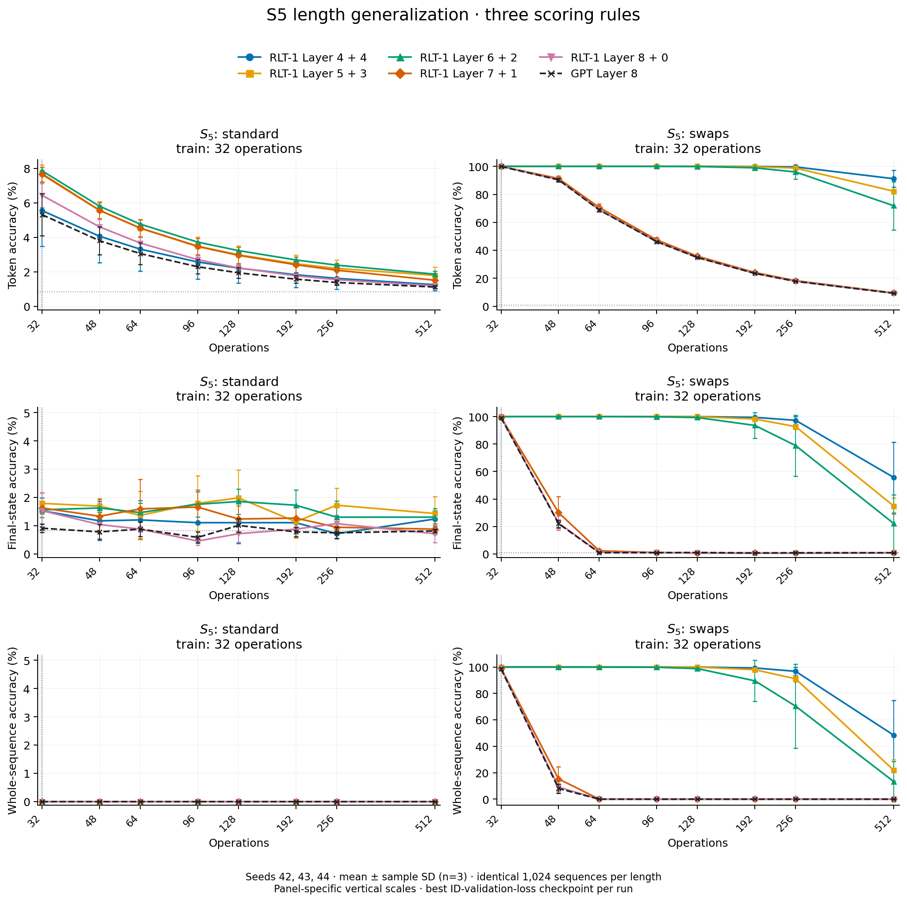

Whole-sequence accuracy requires every prefix prediction to be correct. Each panel labels its vertical scale.
[PDF](assets/experiments-depth8/generalization-depth08-s5-metrics.pdf)

[Training loss](assets/experiments-depth8/training-loss.png), [individual parity seeds](assets/experiments-depth8/parity-individual-seeds.png), [fixed-length token accuracy](assets/experiments-depth8/validation-token-accuracy.png), and [token-level length generalization](assets/experiments-depth8/generalization-depth08-token-accuracy.png) provide additional diagnostics.
[Depth-eight figures and protocol](assets/experiments-depth8/README.md)

### Sixteen-layer parity

A separate seed-42 series trains RLT-1 8+8 through 16+0 and Transformer 16 on parity lengths 3–40 with global batch 1,024.
All ten runs completed 2,000 steps.
Comparing each run's best in-distribution checkpoint with its step-2,000 checkpoint on the same 1,024 examples per length leaves 74 of 80 accuracies unchanged.
**8+8, 9+7, 11+5 and 16+0 retain 100% at 256 bits** at both checkpoints, compared with 49.41% for Transformer 16.

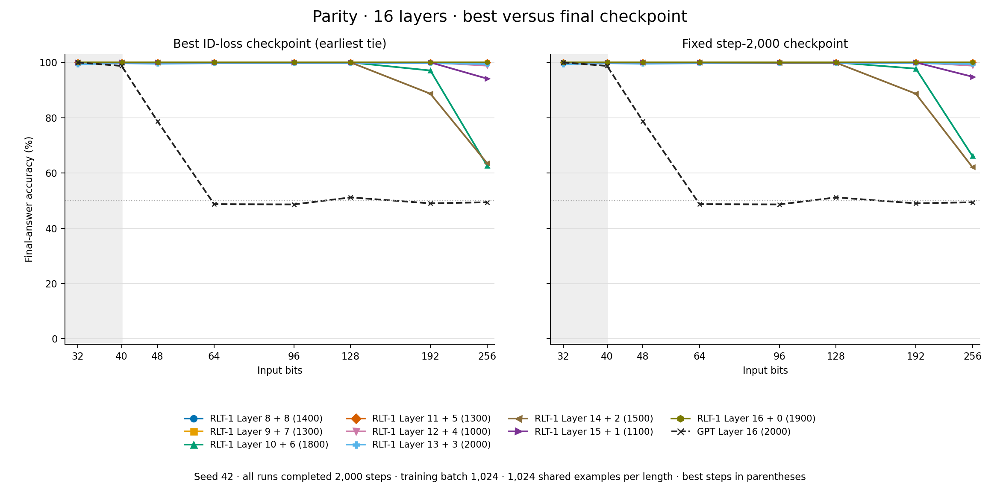

Accuracy (%) at 256 bits:

| Model | Best step | Best checkpoint | Step 2,000 |
| --- | ---: | ---: | ---: |
| RLT-1 8+8 | 1,400 | 100.00 | 100.00 |
| RLT-1 9+7 | 1,300 | 100.00 | 100.00 |
| RLT-1 10+6 | 1,800 | 62.70 | 66.11 |
| RLT-1 11+5 | 1,300 | 100.00 | 100.00 |
| RLT-1 12+4 | 1,000 | 98.83 | 98.83 |
| RLT-1 13+3 | 2,000 | 99.41 | 99.41 |
| RLT-1 14+2 | 1,500 | 63.57 | 62.11 |
| RLT-1 15+1 | 1,100 | 94.14 | 94.82 |
| RLT-1 16+0 | 1,900 | 100.00 | 100.00 |
| Transformer 16 | 2,000 | 49.41 | 49.41 |

## One execution across training and inference

| Mode | Encoder | Decoder and gradients |
| --- | --- | --- |
| Prompt prefill | Causal batch over known tokens | Recur through every prompt token and construct decoder SWA KV |
| Generation | Incremental encoding | Sample from the preceding state, then consume the token exactly once |
| Pretraining | Causal batch | Full BPTT; supervise every valid next-token target |
| SFT | Causal batch | Full BPTT; supervise assistant targets while updating state on all context tokens |
| Current-policy RL replay | Rebuild under current weights | Reconstruct the full history, including SWA caches; evaluate actions before consuming them |

Exact current-policy replay rebuilds parameter-dependent caches after weight updates.
Full gradients pass through recurrent outputs, decoder KV and encoder memory; detaching them changes the gradient.
The report specifies the sampling and replay distributions used for importance weighting.

## Independent community experiments

Synthetic state-tracking results contributed by [@AradhyeAgarwal](https://x.com/AradhyeAgarwal), using a small implementation with approximately **79K parameters** and **3 seeds**. Training length is **32 operations**; evaluation extends to **128 operations (4× the training length)**, with **2,048 test programs per task and length**.


Final-state accuracy by number of operations:

**Parity**

| Model | 16 operations | 32 operations (train length) | 64 operations (2×) | 128 operations (4×) |
| --- | ---: | ---: | ---: | ---: |
| RLT | ≈100% | ≈100% | ≈82% | 60.8% |
| Transformer | ≈98% | ≈72% | ≈50% | ≈48% |
| Token-only merge | ≈98% | ≈59% | ≈49% | ≈50% |

**Five-state transitions**

| Model | 16 operations | 32 operations (train length) | 64 operations (2×) | 128 operations (4×) |
| --- | ---: | ---: | ---: | ---: |
| RLT | ≈100% | ≈100% | ≈49% | 20.7% |
| Transformer | ≈54% | ≈24% | ≈20% | ≈21% |
| Token-only merge | ≈50% | ≈23% | ≈20% | ≈20% |

Values marked ≈ are approximate readings from the original figure; exact values are not labeled. RLT's 128-operation values are taken from the figure's numeric labels.

RLT fits both tasks at the training length, but accuracy declines on longer sequences. Chance accuracy is 50% for parity and 20% for five-state transitions. Points in the original figure show means across seeds; whiskers show seed minima and maxima. Parameter and data budgets were matched; FLOPs were not. These community results use a separate implementation and evaluation protocol from the experiments above.

## Resources

- [Updated paper](./Recurrent_Looped_Transformer.pdf)
- [中文论文](./Recurrent_Looped_Transformer_ZH.pdf)
- [Project website](https://yifanzhang-pro.github.io/recurrent-looped-tranformer/)
- [Depth-eight experiment figures](assets/experiments-depth8/README.md)
- [Feedback-variant and sixteen-layer parity figures](assets/variants-20260925/README.md)
- [Presentation slides](https://yifzhang.com/slides-rlt/)
- [Prefill–decode kernel mismatch note](https://github.com/yifanzhang-pro/Pretraining-RL-Science/blob/master/Prefill_Decode_Kernel_Mismatch.pdf)

## Citation

```bibtex
@techreport{zhang2026recurrentlooped,
  title  = {Recurrent Looped Transformer},
  author = {Zhang, Yifan and Feng, Jichen and Qin, Shihan},
  year   = {2026},
  month  = sep,
  url    = {https://github.com/yifanzhang-pro/recurrent-looped-tranformer}
}
```

## License

Copyright 2026 Yifan Zhang. Licensed under the [Apache License 2.0](./LICENSE).
